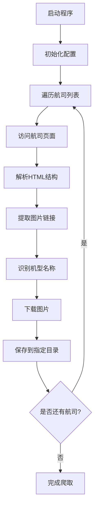

# AeroLOPA 航司机型图片爬虫系统

## 项目概述

本项目是一个专门用于爬取 AeroLOPA 网站（https://www.aerolopa.com/）航司机型座位图的Python爬虫程序。该程序能够自动抓取各大航空公司的机型座位布局图片，并按照航司代码和机型名称进行分类存储。

## 系统架构设计

### 1. 核心模块架构

```
AerolopaCrawler/
├── main.py              # 主程序入口
├── config.py            # 配置文件
├── airlines_config.py   # 航司配置文件（133个航司信息）
├── requirements.txt     # 依赖包列表
├── aircraft_data.csv    # 爬取数据记录文件
├── README.md           # 项目文档
├── logs/               # 日志文件目录
│   └── crawler.log     # 运行日志
└── data/               # 数据存储目录
    ├── AA/             # 美国航空
    │   ├── A320.jpg
    │   ├── B737.jpg
    │   └── ...
    ├── BA/             # 英国航空
    │   ├── A350.jpg
    │   ├── B777.jpg
    │   └── ...
    └── .../            # 其他航司
```

### 2. 技术栈

- **网络请求**: requests
- **HTML解析**: BeautifulSoup4 + lxml
- **图片处理**: Pillow
- **进度显示**: tqdm
- **重试机制**: retrying
- **日志记录**: logging
- **路径处理**: pathlib

### 3. 系统流程设计



## 功能特性

### 1. 智能网页解析
- 自动识别航司页面结构
- 提取机型座位图链接
- 智能机型名称识别

### 2. 健壮的错误处理
- 网络请求重试机制
- 异常捕获和日志记录
- 优雅的错误恢复

### 3. 高效的文件管理
- 按航司代码分类存储
- 自动创建目录结构
- 避免重复下载

### 4. 用户友好的界面
- 实时进度显示
- 详细的日志输出
- 清晰的状态反馈

## 配置说明

### 主要配置项

| 配置项 | 默认值 | 说明 |
|--------|--------|------|
| BASE_URL | https://www.aerolopa.com | 目标网站地址 |
| REQUEST_TIMEOUT | 30 | 请求超时时间(秒) |
| REQUEST_DELAY | 1 | 请求间隔时间(秒) |
| MAX_RETRIES | 3 | 最大重试次数 |
| DATA_DIR | data | 数据存储目录 |

### 航司配置文件 (airlines_config.py)

`airlines_config.py` 是航司信息的统一配置文件，包含133个国际航空公司的完整信息：

**主要功能：**
- **AIRLINES字典**: 包含所有航司的IATA代码、中文名称、英文名称映射
- **get_airline_info(code)**: 根据IATA代码获取航司详细信息
- **get_all_airlines()**: 获取所有支持的航司列表
- **get_supported_iata_codes()**: 获取所有支持的IATA代码列表

**使用示例：**
```python
from airlines_config import get_airline_info, get_all_airlines

# 获取特定航司信息
airline_info = get_airline_info('MU')
print(airline_info)  # {'chinese_name': '中国东方航空', 'english_name': 'China Eastern Airlines'}

# 获取所有航司
all_airlines = get_all_airlines()
print(f"支持的航司数量: {len(all_airlines)}")
```

**配置文件优势：**
- 集中管理航司信息，便于维护和更新
- 支持中英文航司名称，便于国际化
- 提供便捷的查询接口
- 易于扩展新的航司信息

### 支持的航司列表

本系统支持 **133个国际航空公司** 的数据爬取，航司信息统一管理在 `airlines_config.py` 配置文件中。

#### 主要航司分布：

- **美洲地区**: AA(美国航空), UA(联合航空), AC(加拿大航空), DL(达美航空), WN(西南航空), AS(阿拉斯加航空) 等
- **欧洲地区**: BA(英国航空), AF(法国航空), LH(汉莎航空), KL(荷兰皇家航空), IB(伊比利亚航空), AZ(意大利航空) 等
- **亚太地区**: NH(全日空), SQ(新加坡航空), CX(国泰航空), QF(澳洲航空), TG(泰国国际航空), MH(马来西亚航空) 等
- **中东地区**: EK(阿联酋航空), QR(卡塔尔航空), TK(土耳其航空), EY(阿提哈德航空), MS(埃及航空) 等
- **中国地区**: CA(国航), MU(东航), CZ(南航), HU(海南航空), 3U(四川航空), 9C(春秋航空) 等
- **其他地区**: SA(南非航空), ET(埃塞俄比亚航空), EL(日本航空), OZ(韩亚航空) 等

> 💡 **提示**: 完整的航司列表和详细信息请查看 `airlines_config.py` 文件，包含每个航司的IATA代码、中文名称和英文名称。

## 数据存储格式

### 目录结构
```
data/
├── AA/                 # 航司代码(大写)
│   ├── A320.jpg       # 机型名称.扩展名
│   ├── B737.jpg
│   └── B777.jpg
├── BA/
│   ├── A350.jpg
│   └── B787.jpg
└── .../
```

### CSV数据记录

系统会自动生成 `aircraft_data.csv` 文件，记录所有下载的图片信息：

| 字段名 | 说明 | 示例 |
|--------|------|------|
| airline_code | 航司IATA代码 | MU |
| airline_name_cn | 航司中文名称 | 中国东方航空 |
| airline_name_en | 航司英文名称 | China Eastern Airlines |
| aircraft_type | 机型名称 | A320 |
| image_path | 图片存储路径 | data/MU/A320.jpg |
| download_time | 下载时间 | 2024-01-15 10:30:25 |

**CSV文件特点：**
- 自动生成和更新
- UTF-8编码，支持中文
- 便于数据分析和统计
- 可用Excel或其他工具打开

### 文件命名规则
- 航司目录：使用IATA二字代码（大写）
- 图片文件：机型名称 + 原始扩展名
- 支持格式：JPG, PNG, GIF, WEBP

## 错误处理机制

### 1. 网络层错误处理
- 连接超时重试
- HTTP状态码检查
- 网络异常恢复

### 2. 数据层错误处理
- HTML解析异常处理
- 图片下载失败重试
- 文件系统错误处理

### 3. 日志记录
- **统一日志管理**: 所有日志文件统一存储在 `logs/` 目录
- **详细的操作日志**: 记录爬取过程、下载状态、错误信息
- **性能统计信息**: 包含下载速度、成功率、耗时统计
- **日志轮转**: 支持按日期和大小进行日志文件管理
- **多级日志**: 支持DEBUG、INFO、WARNING、ERROR等不同级别

## 性能优化

### 1. 请求优化
- Session复用
- 合理的请求间隔
- User-Agent伪装

### 2. 存储优化
- 避免重复下载
- 批量目录创建
- 文件存在性检查

### 3. 内存优化
- 流式文件下载
- 及时资源释放
- 合理的并发控制

## 安装说明

### 系统要求
- Python 3.8 或更高版本
- Windows/Linux/macOS 操作系统
- 至少 1GB 可用磁盘空间

### 快速开始

1. **克隆或下载项目**
```bash
git clone <repository-url>
cd aerolopaCrawler
```

2. **创建虚拟环境**
```bash
# Windows
python -m venv .venv
.venv\Scripts\activate

# Linux/macOS
python3 -m venv .venv
source .venv/bin/activate
```

3. **安装依赖包**
```bash
pip install -r requirements.txt
```

4. **运行爬虫**
```bash
python main.py
```

### 详细使用说明

#### 1. 基本运行
```bash
# 爬取所有配置的航司
python main.py

# 查看帮助信息
python main.py --help
```

#### 2. 自定义配置
编辑 `config.py` 文件来自定义爬取行为：
- 修改 `AIRLINES` 列表来选择要爬取的航司
- 调整 `REQUEST_DELAY` 来控制请求频率
- 修改 `DATA_DIR` 来改变存储目录

#### 3. 查看结果
- **图片文件**: 存储在 `data/` 目录下，按航司分类
- **CSV数据文件**: `aircraft_data.csv` 记录所有下载图片的详细信息
- **运行日志**: `logs/crawler.log` 文件记录详细操作信息
- **控制台输出**: 实时显示爬取进度和状态

**CSV数据文件使用：**
```bash
# 使用Excel打开CSV文件
start aircraft_data.csv

# 使用Python分析数据
python -c "import pandas as pd; df=pd.read_csv('aircraft_data.csv'); print(df.head())"

# 统计各航司下载数量
python -c "import pandas as pd; df=pd.read_csv('aircraft_data.csv'); print(df['airline_code'].value_counts())"
```

#### 4. 监控进度
程序运行时会显示：
- 当前处理的航司和机型
- 下载进度条
- 成功/失败统计
- 预计完成时间

## 扩展说明

### 1. 添加新航司
在 `config.py` 的 `AIRLINES` 列表中添加新的航司代码即可。

### 2. 自定义机型识别
在 `config.py` 的 `AIRCRAFT_TYPES` 列表中添加新的机型关键词。

### 3. 调整爬取策略
修改 `config.py` 中的请求参数来调整爬取行为。

## 故障排除

### 常见问题

#### 1. 网络连接问题
```
错误: requests.exceptions.ConnectionError
解决: 检查网络连接，确认可以访问 https://www.aerolopa.com
```

#### 2. 权限错误
```
错误: PermissionError: [Errno 13] Permission denied
解决: 确保对data目录有写入权限，或以管理员身份运行
```

#### 3. 依赖包安装失败
```
错误: pip install 失败
解决: 升级pip版本 (pip install --upgrade pip) 或使用国内镜像源
```

#### 4. 图片下载失败
```
错误: 部分图片无法下载
解决: 检查网络稳定性，程序会自动重试失败的下载
```

### 性能优化建议

1. **调整请求间隔**: 如果网络较慢，可以增加 `REQUEST_DELAY` 值
2. **选择性爬取**: 修改 `AIRLINES` 列表，只爬取需要的航司
3. **磁盘空间**: 定期清理不需要的图片文件
4. **日志管理**: 定期清理或归档日志文件

## 注意事项

1. **合规使用**: 请遵守网站的robots.txt和使用条款
2. **请求频率**: 避免过于频繁的请求，以免对目标网站造成压力
3. **数据更新**: 网站结构可能发生变化，需要相应调整解析逻辑
4. **存储空间**: 确保有足够的磁盘空间存储图片文件
5. **文件大小检查**: 程序会自动检查文件大小，小于50KB的文件会被重新下载以确保高质量

## 版本历史

### v1.3.0 (当前版本)
- ✅ **航司配置优化**: 创建独立的 `airlines_config.py` 配置文件，支持133个国际航空公司
- ✅ **CSV数据记录**: 自动生成 `aircraft_data.csv` 文件，记录航司信息、机型和图片路径
- ✅ **日志管理优化**: 统一日志管理，所有日志文件存储在 `logs/` 目录
- ✅ **数据结构优化**: 改进项目结构，便于维护和扩展
- ✅ **配置文件增强**: 提供便捷的航司信息查询接口和工具函数
- ✅ **文档完善**: 更新README文档，添加详细的使用说明和配置指南

### v1.2.0
- ✅ 修复高分辨率图片下载问题
- ✅ 添加文件大小检查机制（自动重新下载小于50KB的文件）
- ✅ 改进srcset解析逻辑，确保获取最高分辨率图片
- ✅ 优化错误处理和重试机制
- ✅ 完善项目文档和使用说明

### v1.1.0
- ✅ 支持详细页面图片爬取
- ✅ 添加机型识别和分类功能
- ✅ 改进网络请求稳定性

### v1.0.0
- ✅ 初始版本，支持基础爬取功能
- ✅ 支持主要航司的机型图片爬取
- ✅ 完整的错误处理和日志记录
- ✅ 用户友好的进度显示

## 许可证

本项目仅供学习和研究使用，请勿用于商业用途。使用时请遵守相关法律法规和网站使用条款。